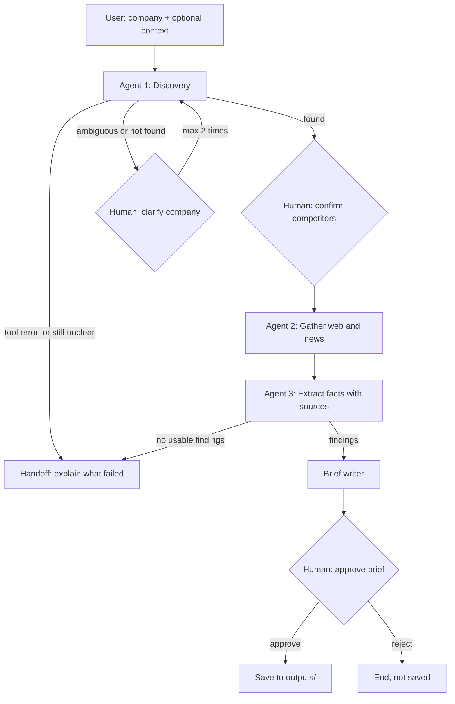

# Competitor Research Agent

Give the agent a company name, and optionally a short description of what it does. The agent finds its top 3 competitors, then researches each one's pricing, core features, positioning and recent news, with the source links for each. It then writes a Markdown competitor brief. A human confirms the competitor list and approves the brief before anything is saved, and is asked to clarify when the company name is ambiguous.

Built for Week 3 of The Gen Academy "Mastering Agentic AI" course (use case 3A, code track).

## How it works



External services:

| Service | Used for | Key in `.env` |
|---|---|---|
| You.com Search API | Web and news search | `YDC_API_KEY` |
| OpenAI `gpt-5.4-mini` | Discovery and extraction | `OPENAI_API_KEY` |
| Nebius `Qwen3-30B-A3B-Instruct` | Executive summary of the brief (falls back to OpenAI if Nebius is unavailable) | `NEBIUS_API_KEY` |

## What makes it an agent

- **Decides its next step:** the LLM judges whether competitors were found, the name is ambiguous or more searching is needed. Routing functions then choose the next node (`agent/discovery.py`, `agent/graph.py`).
- **Calls tools:** it runs You.com web and news searches through `search_you` (`agent/tools.py`, used by `agent/discovery.py` and `agent/researcher.py`).
- **Holds state across pauses:** the shared state (`agent/state.py`) is saved by a LangGraph in-memory checkpointer. The run pauses with `interrupt()` and resumes after a human answers (`agent/graph.py`).
- **Recovers from errors:** it retries failed searches, skips competitors whose searches fail, caps the number of searches and falls back from Nebius to OpenAI (`agent/tools.py`, `agent/researcher.py`, `agent/brief.py`).
- **Hands off to a human:** when it can't continue, it stops and explains what failed and what to do next (`handoff` in `agent/graph.py`).

## Quick start

Prerequisites: Python 3.12 and [uv](https://docs.astral.sh/uv/).

```bash
git clone https://github.com/L-Upadhyay/competitor-research-agent.git
cd competitor-research-agent
uv sync
cp .env.example .env   # then add your YDC_API_KEY, OPENAI_API_KEY and NEBIUS_API_KEY
```

Run the web interface:

```bash
uv run streamlit run app.py
```

Terminal version (fallback):

```bash
uv run python main.py
```

Failure demo: to simulate a You.com timeout for every search that mentions a name, enter that name in the sidebar field "Demo: make searches fail for", or run:

```bash
uv run python main.py --fail Brex
```

## Project structure

```
competitor-research-agent/
├── agent/
│   ├── __init__.py      # marks agent/ as a Python package
│   ├── state.py         # AgentState: the shared state passed between steps
│   ├── tools.py         # search_you: You.com search with retry and the failure demo switch
│   ├── llm.py           # shared OpenAI model setup (gpt-5.4-mini, temperature 0)
│   ├── discovery.py     # Agent 1: finds up to 3 competitors, or asks for clarification
│   ├── researcher.py    # Agent 2: product and news searches per competitor, 20-search cap
│   ├── extractor.py     # Agent 3: pricing, features, positioning and news, with source checks
│   ├── brief.py         # builds the Markdown brief; executive summary via Nebius or OpenAI
│   └── graph.py         # LangGraph workflow: routing, human pauses, handoff, saving
├── app.py               # Streamlit web interface
├── main.py              # terminal interface (fallback)
├── scripts/
│   ├── test_you.py          # manual check of search_you: normal, recent news, bad key
│   ├── test_discovery.py    # discovery on three example companies (real API calls)
│   ├── test_researcher.py   # gathering: normal run, failing search, search limit (real API calls)
│   ├── test_extractor.py    # gather and extract with one competitor failing (real API calls)
│   ├── test_graph.py        # full runs with scripted answers; regenerates outputs/ (real API calls)
│   ├── test_edge_cases.py   # routing edge cases with fake tools (no API calls)
│   └── test_app.py          # Streamlit app test with fake tools (no API calls)
├── outputs/             # saved briefs
├── notes/
│   └── prompts_log.md   # every prompt used to build the project, with results
├── .env.example         # template for the three API keys
└── pyproject.toml       # project metadata and dependencies
```

## Error handling and guardrails

| Failure | What the agent does |
|---|---|
| Search timeout, HTTP 429 or 5xx | Waits 2 seconds and retries once |
| All searches for a competitor fail | Skips that competitor, carries on with the others and lists it under "Data gaps" in the brief |
| A search succeeds but returns no results | Retries once with reworded wording |
| Search budget used up | Stops gathering at 20 searches per run (discovery searches included) and notes it under "Data gaps" |
| You.com or the LLM fails during discovery | Goes straight to handoff, naming the failed service and the key to check |
| Extraction fails for every competitor | Goes to handoff instead of writing an empty brief |
| Nebius fails | Writes the executive summary with OpenAI instead |
| Company name is ambiguous or not found | Asks the human to clarify, at most 2 times, then hands off |
| Human doesn't approve the brief | Nothing is saved |

Guardrails in code:

- The company name must appear in the search results before discovery accepts a decision.
- News items and sources must be URLs of real search results.
- A news item's result must name the competitor as a whole word, so "Brexit" doesn't count as news about "Brex".
- Sponsored content is dropped from news.
- Publish dates and the "older than 12 months" flag are set in code from You.com's publish date, not by the LLM.
- Limits: at most 3 competitors, 5 features and 3 news items per competitor.

## Sample output

Briefs from the scripted test runs:

- [outputs/ramp_brief.md](outputs/ramp_brief.md): Ramp, with context "corporate card and spend management"
- [outputs/mercury_brief.md](outputs/mercury_brief.md): Mercury, with no context, clarified by the human
- [outputs/ramp_brief_with_failure.md](outputs/ramp_brief_with_failure.md): Ramp, with the first competitor's searches forced to fail

First lines of `outputs/ramp_brief.md`:

```markdown
# Competitor brief: Ramp

_Context: corporate card and spend management_

_Generated 2026-09-16 · Competitors: Brex, Airwallex, Expensify_

## Executive summary

Brex positions itself as a corporate card and spend management platform tailored for startups and scaling companies, integrating cards, accounts payable, and workflow tools into a unified system. Airwallex differentiates by focusing on cross-border payments and global financial operations, offering tiered plans with increasing capabilities for advanced finance teams, including dedicated support and multi-conditional approvals. Expensify emphasizes expense management and automation across businesses of all sizes, with a free tier for individuals and recent moves to integrate AI-powered tools like Claude and Rillet. While Brex and Airwallex both offer corporate cards and spend controls, Brex’s pricing scales with employee count and includes a free tier, whereas Airwallex’s Free plan requires a minimum deposit or balance, with no clear USD pricing stated. Expensify’s pricing is not available in the findings, but its recent news highlights a strong push into AI-driven expense and ERP integrations, signaling a shift toward intelligent automation.

## Brex

**Pricing:** Brex offers three subscription plans. The Brex Essentials plan is $0 per user each month; results also mention Premium and Enterprise tiers, but no exact prices are stated. One result says pricing scales primarily with the number of active employees (cardholders and non-cardholders who use the platform), with per-employee rates often decreasing at higher volumes (e.g., 100+ employees, 500+ employees).

**Core features:**
```

## Testing

No API calls (fake tools):

```bash
uv run python scripts/test_edge_cases.py
uv run python scripts/test_app.py
```

Real API calls (uses your keys and regenerates the briefs in `outputs/`):

```bash
uv run python scripts/test_graph.py
```

## Limitations and next steps

- Competitor picks vary between runs, which is why a human confirms the list before research starts.
- The news filter can still let through company blog listicles and articles that only mention the competitor in passing.
- Memory lasts for one run only: the checkpointer is in-memory, so nothing is kept after the app or script stops.
- There is no defence against prompt injection in web content passed to the LLMs.
- It runs only in the terminal or as a local Streamlit app.
- There is no evaluation beyond the scripted test runs.

## Build notes

Designed with Claude (chat) and implemented with Claude Code. Every prompt used to build the project, with its result, is in [notes/prompts_log.md](notes/prompts_log.md).
