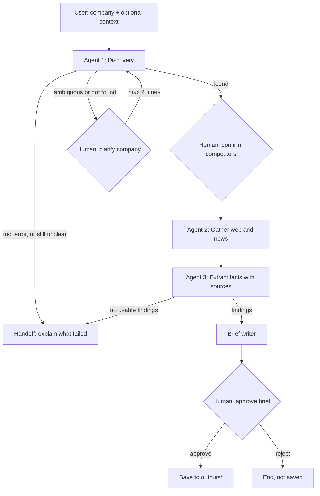

<!-- Log of prompts used while building and tuning the agent. -->

# Prompts Log

Times are local (EDT). Earlier entries marked "~" were added after the fact and use the matching commit time, because the exact send time wasn't recorded.

---

## Project setup

**Time:** ~2026-09-16 18:23

```
Set up this project folder. Run `uv init --python 3.12` (if it creates main.py, README.md or a git repo, keep them, don't duplicate), then `uv add langgraph langchain-openai requests python-dotenv`.

Create this structure with placeholder files, each with a one-line comment saying its purpose:
- main.py
- agent/__init__.py
- agent/state.py
- agent/tools.py
- agent/discovery.py
- agent/researcher.py
- agent/graph.py
- scripts/test_you.py
- outputs/ (with a .gitkeep)
- notes/prompts_log.md
- README.md (title only: Competitor Research Agent)

Create .gitignore covering .env, .venv/, __pycache__/.
Create .env.example with these three lines:
YDC_API_KEY=
OPENAI_API_KEY=
NEBIUS_API_KEY=

Do NOT write any agent logic yet.

Then make sure git is initialized, make a first commit, and run:
gh repo create L-Upadhyay/competitor-research-agent --public --source . --push

Finally, confirm .env is not tracked by git and show me the folder tree.
```

**Result:** Worked. uv's own main.py, README.md, .gitignore and git repo were kept, not duplicated. The repo was created on GitHub and pushed; .env is ignored. Note: the default branch is `master`.

---

## Project setup: status check

**Time:** 2026-09-16, between 18:23 and 20:38 (not recorded)

```
You didn't respond to my last message. Check what already exists in this folder, finish only the remaining setup steps from that message, then show me the folder tree and the GitHub link.
```

**Result:** Worked. Every setup step was already done, so nothing changed; I re-checked each step and showed the tree and link again.

---

## Project setup: branch name

**Time:** 2026-09-16, between 18:23 and 20:38 (not recorded)

```
no
```

**Result:** Worked. Declined renaming `master` to `main`; the branch stays `master`.

---

## You.com search smoke test

**Time:** ~2026-09-16 20:39

```
Two things:
1. Create agent/extractor.py with a one-line comment: "Extraction step: turns raw search results into pricing, features, positioning and recent news."
2. Write scripts/test_you.py: load YDC_API_KEY from .env with python-dotenv (exit with a clear message if missing), call GET https://api.you.com/v1/search with header X-API-Key, query "Ramp corporate card competitors", count 3, timeout 20 seconds. Print the status code, then the title and URL of each web result, and also say how many news results came back. Never print the API key.
Run it with `uv run python scripts/test_you.py` and show me the output. If the response shape differs from what you expected, print the top-level JSON keys so we can see the real structure. Commit when it works.
```

**Result:** Worked on the first run: HTTP 200, 3 web results, 0 news results. The response shape was as expected (`results.web` / `results.news`).

---

## You.com search smoke test: push

**Time:** ~2026-09-16 20:40

```
yes
```

**Result:** Worked. Pushed the commit to GitHub.

---

## Agent state and You.com search tool

**Time:** ~2026-09-16 20:43

```
Next component: agent/state.py and agent/tools.py. Keep both simple and well commented so a non-coder can follow them.

1. agent/state.py: a TypedDict called AgentState with these fields:
   company (str), competitors (list[str]), raw_results (dict: competitor name -> search results),
   findings (dict: competitor name -> extracted info), errors (list[str]),
   search_count (int), brief (str).

2. agent/tools.py: a function search_you(query, count=5, recent_only=False) that calls the You.com search API.
   - Reads YDC_API_KEY from .env.
   - If recent_only is True, restrict results to recent content using You.com's freshness parameter (check the You.com API docs for the exact parameter name and value; don't guess).
   - Timeout 20 seconds.
   - On a timeout, a 429, or a 5xx error: wait 2 seconds and retry once.
   - On a 401/403: don't retry; return an error saying to check YDC_API_KEY.
   - Never raise an exception to the caller. Always return a dict:
     success: {"ok": True, "web": [...], "news": [...]}
     failure: {"ok": False, "error": "<plain-English reason>"}
   - Trim each result to title, url and snippet (first snippet, max 500 characters) to keep LLM costs low.

3. Update scripts/test_you.py to test three cases and print the result of each:
   a) normal: search_you("Brex corporate card pricing")
   b) news: search_you("Brex news", recent_only=True), and report how many news and web results came back
   c) failure: temporarily use a fake API key and show that it returns ok=False with a clear message instead of crashing

Run it, show me the output, then commit and push.
```

**Result:** Worked. All 3 cases passed: (a) 5 web results; (b) 5 web + 5 news results, using `freshness="month"` from the docs; (c) ok=False with "You.com rejected the API key (HTTP 401)". Issues found: news for "Brex news" was mostly off-topic (e.g. Brexit), freshness still let a 2022 web article through, and the retry path wasn't exercised. News results have no snippets, so the tool falls back to the description.

---

## Prompts log process

**Time:** 2026-09-16 20:45

```
From now on, after finishing each task, append the exact prompt I sent you to notes/prompts_log.md, with the time, a heading naming the component, and one line on the result (worked / what failed and what we changed). Start by adding the prompts I've already sent in this session, in order. Include this log update in each commit.
```

**Result:** Worked. Added this log with all earlier prompts from the session in order; from now on each task's prompt is logged and included in its commit.

---

## Discovery agent (Agent 1)

**Time:** 2026-09-16 20:52

```
Next component: agent/discovery.py (Agent 1). Keep it simple and well commented for a non-coder.

1. Add these fields to AgentState in agent/state.py:
   company_context (str): an optional clarification from the human, e.g. "the fintech bank"
   discovery_status (str): "found" | "ambiguous" | "not_found"
   human_question (str): the question for the human when the agent needs help

2. Model setup: use ChatOpenAI from langchain-openai with an inexpensive current OpenAI mini model. Verify the model name actually works with one quick call before using it. Put the model name in one constant at the top of a new file agent/llm.py so all agents share it. Read OPENAI_API_KEY from .env. temperature=0.

3. agent/discovery.py: a function discover(state) -> dict with state updates.
   - Search with search_you: "{company} {company_context} competitors" (count 5).
   - If the search returns ok=False, record the error in state["errors"] and set discovery_status="not_found" with a human_question explaining what failed.
   - Otherwise send the results to the LLM with structured output (a Pydantic model) returning:
     status: "found" | "ambiguous" | "not_enough_info"
     competitors: list of up to 3 company names (only when found)
     question: a short question for the human (only when ambiguous)
     better_query: an improved search query (only when not_enough_info)
   - The prompt must tell the LLM: use only the search results, don't invent companies, and pick "ambiguous" if the name could refer to more than one company.
   - If not_enough_info: run ONE more search with better_query and ask the LLM again. If it's still not found, set discovery_status="not_found" with a human_question asking for more context.
   - Increment search_count for every search.
   - Print one short log line per step, e.g. "[discovery] searching: ...", "[discovery] decision: found -> Brex, Mercury, Navan".

4. Create scripts/test_discovery.py and run 3 cases, printing the returned state updates:
   a) company="Ramp", company_context="corporate card and spend management"
   b) company="Mercury", company_context=""  (expect ambiguous)
   c) company="Zxqvtrbl Labs", company_context=""  (expect not_found after a retry)

Run it, show me the output, then log, commit and push.
```

**Result:** Worked after several fixes; all 3 cases now match expectations. Model: gpt-5.4-mini (verified with temperature=0 and structured output). What failed and what we changed: (1) Mercury came back "found" because the results only showed the bank, so the LLM now first lists `same_name_companies`, and code forces "ambiguous" when there's no context and 2+ are listed (then 5/5 runs ambiguous; Brex/Airwallex still "found"). (2) Zxqvtrbl Labs got a "better" query identical to the first and was once marked ambiguous ("Labs", "World Labs"), so a repeated query now falls back to a different one, and code forces "not_enough_info" when the company name isn't in the results. (3) Ramp was once "ambiguous" despite its context, so ambiguity is ignored when context is given (one more search instead). Added pydantic as a direct dependency.

---

## Researcher / gatherer agent (Agent 2)

**Time:** 2026-09-16 21:01

```
Next component: agent/researcher.py (Agent 2, the gatherer). Keep it simple and commented for a non-coder. Don't change discovery.py.

1. Demo failure switch in agent/tools.py:
   - If the environment variable FAIL_SEARCH_FOR is set and its value appears in the query (case-insensitive), simulate a timeout INSIDE the request attempt, so the real retry-once logic runs, and then return ok=False with the error "simulated timeout (FAIL_SEARCH_FOR)".
   - Print a log line when the retry happens, e.g. "[search] timeout, retrying once...".

2. agent/researcher.py: a function gather(state) -> dict of state updates.
   - MAX_SEARCHES = 12 constant at the top (whole run, including discovery searches already in search_count).
   - For each competitor in state["competitors"]:
     a) product search: "{competitor} pricing features" (count 5)
     b) news search: "{competitor} {company_context} news" (count 5, recent_only=True); if company_context is empty, use "{competitor} company news"
     - If a search succeeds but returns 0 web AND 0 news results, retry once with a reworded query ("{competitor} official site" for product, "{competitor} announcement" for news).
     - If a search fails (ok=False), append a clear message to errors, and continue with the next search / next competitor. Never crash.
     - Before every search, check search_count against MAX_SEARCHES. If the limit is reached, stop gathering, append "search limit reached" to errors, and return what was gathered so far.
   - Store raw_results[competitor] = {"product": [...], "news": [...], "complete": True/False}, where complete=False if any search for that competitor failed or was skipped.
   - Log lines like "[gather] Brex: product search (5 results)", "[gather] Airwallex: news search FAILED -> skipping", "[gather] search limit reached".

3. scripts/test_researcher.py with company="Ramp", company_context="corporate card and spend management", competitors=["Brex","Airwallex","Expensify"]. Run 3 cases, printing only the log lines, then per competitor: number of product results, number of news results, complete flag, plus the errors list and search_count:
   a) normal run, search_count starting at 1
   b) FAIL_SEARCH_FOR="Airwallex" (set in the script via os.environ): expect the retry log, the Airwallex error recorded, Brex and Expensify still complete
   c) search_count starting at 9: expect the limit to stop it partway

Limit yourself to 2 fix rounds. If something is still off after that, stop and report it rather than continuing to iterate. Then log, commit and push.
```

**Result:** Worked on the first run; 0 of 2 fix rounds used. (a) all 3 complete, search_count 1 -> 7; (b) retry log shown twice, 2 Airwallex errors recorded, Brex and Expensify complete; (c) stopped after 3 searches (9 -> 12): Brex complete, Airwallex product only (complete=False), Expensify not reached (complete=False), "search limit reached" in errors. Fixed before the first run: product results were saved only after the news search, so a limit hit in between would have lost them. Not verified: the empty-result reworded retry (You.com returned results even for "Zxqvtrbl Labs"). discovery.py unchanged.

---

## Extractor agent (Agent 3)

**Time:** 2026-09-16 21:08

```
Next component: agent/extractor.py (Agent 3). Keep it simple and commented for a non-coder. Don't change discovery.py or researcher.py.

1. agent/extractor.py: a function extract(state) -> dict of state updates.
   - For each competitor in state["competitors"]:
     - If raw_results has no entry, or both product and news lists are empty: don't call the LLM. Set findings[competitor] to all fields "not available: search failed or skipped", complete=False. Log "[extract] Airwallex: no data -> skipped".
     - Otherwise call the shared LLM (agent/llm.py) with structured output (Pydantic model CompetitorFindings):
       pricing: str
       core_features: list[str] (max 5)
       positioning: str (1-2 sentences)
       recent_news: list of {headline, date, url, is_old: bool} (max 3)
       sources: list[str] (URLs actually used)
     - Prompt rules: use ONLY the provided results; if something isn't stated, write "not found" (never guess prices); only include news that is clearly about this competitor (drop anything about other topics, e.g. "Brexit" for "Brex"); mark is_old=True if the item is more than 12 months before today's date (pass today's date in the prompt); every item must come from a result's URL.
     - Pass only title, url and snippet to the LLM.
     - If the LLM call raises an error: append a clear message to errors, set that competitor's findings to "not available: extraction failed", complete=False, and continue.
     - Set complete from raw_results[competitor]["complete"].
   - Log one line per competitor, e.g. "[extract] Brex: pricing found, 5 features, 2 news (1 old)".

2. scripts/test_extractor.py with company="Ramp", company_context="corporate card and spend management", competitors=["Brex","Airwallex","Expensify"]:
   - Run gather() once with FAIL_SEARCH_FOR="Airwallex", then extract() on the result.
   - Print the log lines and the findings as readable JSON, plus errors.
   - Expect: Brex and Expensify filled in with source URLs, Airwallex skipped without an LLM call, no off-topic news.

Limit yourself to 2 fix rounds. If something is still off after that, stop and report it. Then log, commit and push.
```

**Result:** Expectations met after 2 fix rounds (limit reached; stopped there). Brex and Expensify filled in with source URLs, Airwallex skipped without an LLM call, no off-topic news. Round 1: Brex pricing was "not found" although a snippet said "Essentials $0 per user/month", so the pricing rule was spelled out; a Motley Fool item not mentioning Brex was listed as news, so code now requires the competitor's name as a whole word in the result; sources missed product pages, so the prompt now asks for every result used. Round 2: a rejected news URL stayed in sources, the "dropped" count included items cut by the 3-item limit, and a "Sponsored" Forbes ad was listed as news; all three fixed. Still off: most news dates are "not found" (search_you drops You.com's page_age); "news" still includes Brex's own blog and a rewards guide while a Capital One/Brex item was missed; one Expensify item got a date apparently borrowed from a duplicate story; the same Rillet story appears twice; Expensify's "dropped 2" wasn't investigated.

---

## Orchestrator: brief writer, LangGraph graph, interactive runner

**Time:** 2026-09-16 21:16

```
Next component: the orchestrator. Keep it simple and commented for a non-coder. Don't change discovery.py, researcher.py or extractor.py unless a bug blocks the graph (tell me if so). Do the steps in order.

1. agent/state.py: add fields clarify_attempts (int), brief_model (str), saved_path (str), human_decision (str).

2. agent/brief.py: a function write_brief(state) -> dict.
   - Build the per-competitor sections IN CODE from state["findings"] (pricing, features, positioning, recent news with dates and links, sources, and a "⚠ incomplete data" note when complete is False). Handle fields that are text like "not available: ..." instead of lists.
   - Only the executive summary (3-5 sentences comparing the competitors) comes from an LLM, given only the findings.
   - Summary model: try Nebius first via ChatOpenAI with the Nebius OpenAI-compatible base_url and NEBIUS_API_KEY (check Nebius docs for the correct base_url and list available models; pick a small instruct model). If the Nebius call fails for any reason, log "[brief] Nebius failed -> falling back to OpenAI" and use agent/llm.py. Record the model used in brief_model.
   - End the brief with "Data gaps" (the errors list, or "none") and a footer with search_count and the model used.
   - Timebox Nebius to 10 minutes of your effort. If it isn't working by then, keep the OpenAI fallback, leave the Nebius code in place, and tell me why.

3. agent/graph.py: a LangGraph StateGraph over AgentState with an in-memory checkpointer and thread_id.
   Nodes: discover -> (route)
     - found -> confirm_competitors (interrupt(): show the list; the human replies "" to accept or a comma-separated list to replace it)
     - ambiguous / not_found -> clarify (interrupt(): show human_question; the reply becomes company_context, clarify_attempts += 1) -> discover again. If clarify_attempts reaches 2, go to handoff instead.
   confirm_competitors -> gather -> extract -> (route)
     - if no competitor has any data -> handoff
     - else -> write_brief -> approve_brief (interrupt(): show the brief; reply "approve" or "reject")
   approve_brief -> approve: save_brief (write outputs/<company>_brief.md, set saved_path) -> END; reject: END without saving.
   handoff: print a clear message explaining what failed (errors) and what the human should do, then END.
   Every routing decision prints one log line, e.g. "[orchestrator] discovery ambiguous -> asking human". Set a recursion limit of 25.

4. main.py: an interactive terminal runner.
   - Ask for company and optional context with input(). Optional flag --fail NAME sets FAIL_SEARCH_FOR=NAME (for the demo).
   - Run the graph; at each interrupt print the question/payload and resume with Command(resume=input(...)).
   - At the end print where the brief was saved, or that it wasn't.
   - Wrap the run so an unexpected exception prints a friendly message instead of a traceback.

5. scripts/test_graph.py: run the graph NON-interactively with scripted answers and save real outputs:
   a) Ramp, context "corporate card and spend management", FAIL_SEARCH_FOR unset: accept competitors, approve -> outputs/ramp_brief.md
   b) Mercury, no context: answer the clarify question with "the fintech business bank for startups", accept competitors, approve -> outputs/mercury_brief.md
   c) Ramp with FAIL_SEARCH_FOR set to the first competitor discovery returns: accept, approve -> the brief shows that competitor as incomplete in Data gaps (save as outputs/ramp_brief_with_failure.md)
   Print the log lines for each run and the first 40 lines of each brief.

Limit yourself to 2 fix rounds (the Nebius timebox is separate). If something is still off, stop and report it. Then log, commit and push. Also tell me the exact command to run the interactive demo.
```

**Result:** Worked on the first run; 0 of 2 fix rounds used. Nebius worked in about 1 minute: base_url https://api.tokenfactory.nebius.com/v1/, model Qwen/Qwen3-30B-A3B-Instruct-2507, and it wrote all 3 summaries. All 3 briefs saved: (a) Teampay, Clara, Mesh; (b) clarify asked, then Relay, Rho, Brex; (c) Brex failing, shown as incomplete in Data gaps. Also verified: the OpenAI fallback with a fake Nebius key, handoff after 2 clarifications via main.py with piped input, and reject (not saved). No bugs blocked the graph and discovery/researcher/extractor are unchanged. Still off (upstream, not fixed): in (a) discovery's retry query drops the context, so "Mesh" is an unrelated productivity app; Relay pricing mixes in Relay.app; discovery searches count toward the 12-search limit, so 2 clarifications can leave too few searches for gathering. Added output_filename as a run-config option so test runs don't overwrite each other.

---

## Final fix round: discovery context, search budget, publish dates

**Time:** 2026-09-16 21:23

```
Final fix round: three bugs, nothing else. Keep changes minimal and commented. Don't change graph.py, brief.py or main.py.

1. discovery.py: the retry query must keep the human's context. When company_context is set, the better_query / fallback query must include it (e.g. "Ramp corporate card and spend management alternatives"), and the prompt should tell the LLM that competitors must match that context.

2. researcher.py: raise MAX_SEARCHES from 12 to 20, so a run with two clarifications still has enough searches to research three competitors.

3. tools.py + extractor.py: keep You.com's publish date (page_age) on each result as a "date" field when present. Pass it to the extractor LLM next to each result, and tell it to use that date for news items (still "not found" if absent) so is_old works.

Then re-run scripts/test_graph.py to regenerate all three briefs in outputs/. Show me the log lines for each run, the competitors found, and how many news items now have real dates.
Limit yourself to 2 fix rounds. Then log, commit and push.
```

**Result:** Worked; 1 of 2 fix rounds used. (1) When context is set, the retry query keeps it (code replaces an LLM query without it); the prompt says competitors must match the context. Verified with a forced not_enough_info: the retry was "Ramp corporate card and spend management alternatives". (2) MAX_SEARCHES is 20. (3) page_age is kept as "date" and passed to the extractor as "published:"; verified a 2024 item gets is_old=true and an undated item "not found". Regenerated briefs: Ramp -> Brex, Airwallex, Expensify (8/8 news dated); Mercury -> clarified, then Brex, Rho, Grasshopper Bank (8/8); Ramp with Brex failing -> Airwallex, Expensify (6/6), Brex in Data gaps. Before this round almost no news had dates. Fix round 1: dates came back mixed (some with times), so code now trims them to YYYY-MM-DD. Not seen in real runs: discovery's retry (it found competitors on the first try every time) and old news (freshness=month only returns recent items). graph.py, brief.py and main.py unchanged.

---

## Code-review bug fixes: tool errors, confirm/approve answers, extraction routing, news quality

**Time:** 2026-09-16 21:35

```
Final bug-fix round from a code review. Fix only these five issues, keep changes minimal and commented. Don't change anything else.

1. Tool failure in discovery: when the You.com search or the LLM call fails inside discover(), set discovery_status="error" (not "not_found"). In graph.py, route "error" straight to handoff (no clarify). The handoff message for this case must say which service failed and to check the API key / internet, not ask for a better company description.

2. Confirm step (graph.py confirm_competitors): treat "", "y", "yes", "ok", "accept" (any case) as accepting the list. Only anything else is parsed as a comma-separated replacement.

3. Approval: in graph.py normalise "approve", "approved", "yes", "y" -> approve; "reject", "no", "n" -> reject. In main.py, if the answer is none of those, print "Please type approve or reject" and ask again instead of discarding the brief.

4. route_after_extraction: go to write_brief only if at least one competitor has real extracted findings (not the "not available: ..." placeholder). Otherwise go to handoff, with a message that says whether searching or extraction (OpenAI) failed.

5. News quality:
   - In researcher.py, tag every item that came from You.com's news list with "from_news": True (web items False).
   - In extractor.py, only keep a news item if its source result has from_news True (in addition to the existing checks).
   - In extractor.py, set each kept news item's date from the source result's "date" field in CODE (YYYY-MM-DD, or "not found"), ignoring the LLM's date, and compute is_old in code (more than 365 days before today).
   - Accept that some competitors will show "no recent news found".

Tests:
- Add scripts/test_edge_cases.py that uses fakes (no API calls) to check bugs 1-4: You.com failing during discovery goes straight to handoff; typing "yes" at confirm keeps the list; "yes" at approval saves; all extractions failing goes to handoff. Print PASS/FAIL per case.
- Then re-run scripts/test_graph.py to regenerate the three briefs. Show me the edge-case results, the log lines, and the Recent news sections of all three briefs.

Limit yourself to 2 fix rounds. Then log, commit and push.
```

**Result:** Worked; 0 of 2 fix rounds used. Edge cases 4/4 PASS with fakes (run with invalid API keys, so no real calls were possible). The main.py re-ask was checked with piped input ("maybe" -> "Please type approve or reject" -> "Approved" accepted). Regenerated briefs: Ramp -> Brex, Airwallex, Expensify (news only for Airwallex: 3 Fortune articles, dated); Mercury -> clarified, then the retry kept the context -> Aspire, Brex, Ramp (no news for any); Ramp with Brex failing -> Airwallex 3 news, Expensify none, Brex "not available". Checked why news is so sparse: You.com's news list for Brex/Aspire/Ramp had no item naming the competitor (Brexit, NBA, general fintech), and Expensify had no news-list items, so "no recent news found" is correct. Trade-off: real Expensify press releases (listed by You.com as web) are now excluded, and the extractor LLM, unaware of from_news, still picks web items that code drops ("dropped 6"). Only comments added beyond the five fixes (state.py status list, graph.py diagram).

---

## News fix: label results, allow dated news-like web pages

**Time:** 2026-09-16 21:51

```
One more fix, news only. Keep it minimal and commented. Don't change any other behaviour.

1. extractor.py _format_results: label each result as "[news article]" if from_news is True, else "[web page]".
2. Extractor prompt: prefer news articles. A web page may count as news ONLY if it is a dated press release or news story about the competitor, never a pricing page, review, comparison or "alternatives" list, or a company profile page.
3. Code check in extractor.py, replacing the from_news-only rule. Keep a news item if its source is a real result that names the competitor as a whole word, is not sponsored, AND either:
   a) from_news is True, or
   b) it is a web result that has a publish date AND its URL/title does not contain any of: wikipedia.org, linkedin.com, crunchbase, g2.com, capterra, trustradius, pricing, review, alternatives, " vs ", competitors, comparison.
   Dates and is_old stay computed in code from the source result.
4. Re-run scripts/test_edge_cases.py (must still be 4/4 PASS) and scripts/test_graph.py. Show me the Recent news sections of all three briefs.

Limit yourself to 2 fix rounds. Then log, commit and push.
```

**Result:** Worked; 0 of 2 fix rounds used. Edge cases still 4/4 PASS. News improved: Ramp brief -> Brex 1, Airwallex 3 (Fortune), Expensify 3 press releases back (Claude, Rillet); Mercury brief -> Brex 1, Rho 3 (incl. $75m Series B), Grasshopper Bank none; Ramp with Brex failing -> Airwallex 3, BILL Spend & Expense none. All dates from You.com's publish date. Still off (blocklist kept exactly as specified): Rho's own blog listicles "Best Banks for Startup Business Banking in 2026" and "Best Banks for Seed-Stage Startups" pass as news; "Brex Benchmark" is a Brex blog post; the Brex item in the Mercury brief is an American Express story that mentions Brex. Markers like "best " or "/blog" would catch most of these.

---

## Streamlit interface

**Time:** 2026-09-16 21:54

```
Add a Streamlit interface. New file only: app.py in the project root. Do NOT change anything in agent/ or main.py (the terminal version stays as the fallback). Keep it simple and commented for a non-coder.

1. `uv add streamlit`.

2. app.py, using build_graph, initial_state and make_config from agent.graph, and Command from langgraph.types:
   - Keep the graph, config (thread_id), current pause payload, captured log text and final result in st.session_state, so button clicks don't restart the run.
   - Sidebar: company (text), optional context (text), "Demo: make searches fail for" (text, optional; sets FAIL_SEARCH_FOR for this run, cleared otherwise), Start research button, Reset button (also clears FAIL_SEARCH_FOR).
   - Every graph.invoke(...) runs inside st.spinner and captures printed output with contextlib.redirect_stdout. Append it to the log and show it in an expander "Agent decisions log" (open by default) as a code block, so the routing decisions are visible on screen.
   - Pauses, based on payload["kind"]:
     * clarify: show the question in st.info, a text input, and a Submit button -> resume with the text.
     * confirm_competitors: show the competitors as a list, an "Accept these competitors" button (resume with ""), plus a text input prefilled with the comma-separated list and a "Use my list" button (resume with that text).
     * approve_brief: render the brief with st.markdown, then "Approve and save" (resume "approve") and "Reject" (resume "reject") buttons.
   - When the run ends: if saved_path is set, show st.success with the path and a st.download_button for the brief. If it ended in handoff, show the captured HANDOFF text in st.error. If rejected, show st.warning "Brief was not saved."
   - Wrap every invoke in try/except and show a friendly st.error instead of a traceback.

3. Verification without real API calls: add scripts/test_app.py using streamlit.testing.v1.AppTest, with the same fakes as scripts/test_edge_cases.py. Simulate: enter a company, Start, accept competitors, approve, and check that a success message appears. If AppTest is too awkward, at minimum start the app headless (`uv run streamlit run app.py --server.headless true`), confirm it starts without errors, then stop it.

4. Tell me the exact command to launch the app.

Do not commit any new or changed files in outputs/ (delete any test brief the tests create). Hard timebox: if this isn't working after 2 fix rounds, stop, leave app.py committed as-is, and report what's broken. Then log, commit and push.
```

**Result:** Worked on the first run; 0 of 2 fix rounds used. Added streamlit 1.64.0. scripts/test_app.py (AppTest, reusing the fakes from test_edge_cases.py, run with invalid API keys) passes 2/2: the happy path (company -> Start -> accept -> approve -> "Brief saved to" success and the approval line in the log) and an extra case where You.com fails and the handoff text appears in st.error. The test brief uses the made-up company "AppTestCo" and is deleted afterwards. The app also started headless (health "ok", page HTTP 200) and was stopped. agent/, main.py and outputs/ unchanged. Launch: uv run streamlit run app.py. Not tested in a browser with real API calls; the clarify, "Use my list" and reject screens are only exercised by code review.

---

## Streamlit interface: agent timing

**Time:** 2026-09-16 22:03

```
Small addition to app.py only: timing. Don't change anything in agent/, main.py, tests' fakes or outputs/.

1. In run_agent, measure how long each graph.invoke(...) takes with time.perf_counter(). Append a line to the log like "[timing] this step took 41.2 s".
2. Keep a running total in st.session_state (add "agent_seconds": 0.0 and "steps": 0 to DEFAULTS so Reset clears them). Only the invoke time is counted, never the time the human spends answering.
3. When the run ends (any ending: saved, handoff, rejected), show st.caption below the result: "Agent working time: X min Y s across N steps".
4. Re-run scripts/test_app.py (must still pass 2/2). Then log, commit and push.
```

**Result:** Worked; test_app.py still 2/2 PASS. Each invoke is timed with perf_counter (including one that raises) and logs "[timing] this step took X s"; agent_seconds and steps are in DEFAULTS, so Reset clears them (verified). The caption appears under the saved / handoff / rejected result (checked on the reject path: "Agent working time: 0 min 0 s across 3 steps", 0 s because the fakes are instant). Real-run timings not observed yet. Only app.py changed.

---

## README, project description and .gitignore

**Time:** 2026-09-16 22:06

```
Write README.md (replace the title-only file) and set the pyproject.toml description to "Human-in-the-loop competitor research agent built with LangGraph and You.com". Also add .agents/ and .claude/ to .gitignore. Do NOT change any code, tests or outputs. Plain, factual tone: no emojis, no words like "enterprise", "production-ready" or "scalable".

Sections, in this order:

1. Title "Competitor Research Agent" + one short paragraph: what it does (company in -> top 3 competitors -> pricing, core features, positioning, recent news with sources -> brief), with a human approving the key steps. One line: built for Week 3 of The Gen Academy "Mastering Agentic AI" (use case 3A, code track).

2. How it works: this Mermaid diagram exactly (GitHub renders it):

   Then a small table of external services: You.com Search API (web + news search, YDC_API_KEY), OpenAI gpt-5.4-mini (discovery and extraction, OPENAI_API_KEY), Nebius Qwen3-30B-A3B-Instruct (executive summary, NEBIUS_API_KEY, falls back to OpenAI if unavailable).

3. What makes it an agent: five one-line bullets (decides next step, calls tools, holds state across pauses via LangGraph checkpointer, recovers from errors, hands off to a human), each naming the file where it happens.

4. Quick start: prerequisites (Python 3.12, uv), clone, `uv sync`, copy .env.example to .env and add keys, run `uv run streamlit run app.py`, terminal fallback `uv run python main.py`, failure demo (sidebar field, or `uv run python main.py --fail Brex`).

5. Project structure: tree with a one-line comment per file (agent/*, app.py, main.py, scripts/*, outputs/, notes/prompts_log.md).

6. Error handling and guardrails: a table of failure -> what the agent does (search timeout/429/5xx retry once; failed competitor skipped and listed under Data gaps; empty results reworded retry; 20-search cap; You.com or LLM failure in discovery -> handoff; all extractions fail -> handoff; Nebius fails -> OpenAI; ambiguous name -> ask human, max 2 then handoff; nothing saved without approval). Then a short bullet list of guardrails in code: company name must appear in results, news and sources must be real result URLs, competitor named as a whole word, sponsored content dropped, publish dates and "old" flag set in code, max 3 competitors / 5 features / 3 news.

7. Sample output: links to the three files in outputs/ and the first ~15 lines of outputs/ramp_brief.md in a code block.

8. Testing: `uv run python scripts/test_edge_cases.py` and `uv run python scripts/test_app.py` (fakes, no API calls); `uv run python scripts/test_graph.py` (real API calls, regenerates outputs/).

9. Limitations and next steps: competitor picks vary between runs (hence the human confirm step); news filter can let through company blog listicles and passing mentions; memory lasts one run only (in-memory checkpointer); no defence against prompt injection in web content; terminal and local Streamlit only; no evaluation beyond the scripted runs.

10. Build notes: designed with Claude (chat) and implemented with Claude Code; every build prompt is in notes/prompts_log.md.

Then log, commit and push.
```

**Result:** Worked. README.md now has all 10 sections in order: the Mermaid diagram copied exactly, a services table, the agent bullets with file names, quick start, a project tree covering all 7 scripts plus .env.example and pyproject.toml, the error table and guardrails, sample output (first 15 lines of outputs/ramp_brief.md), testing, limitations and build notes. The pyproject.toml description is set, and .agents/ and .claude/ are in .gitignore. No emojis. The only banned word is "Enterprise", inside the copied brief excerpt (Brex's plan name). No code, tests or outputs changed.
